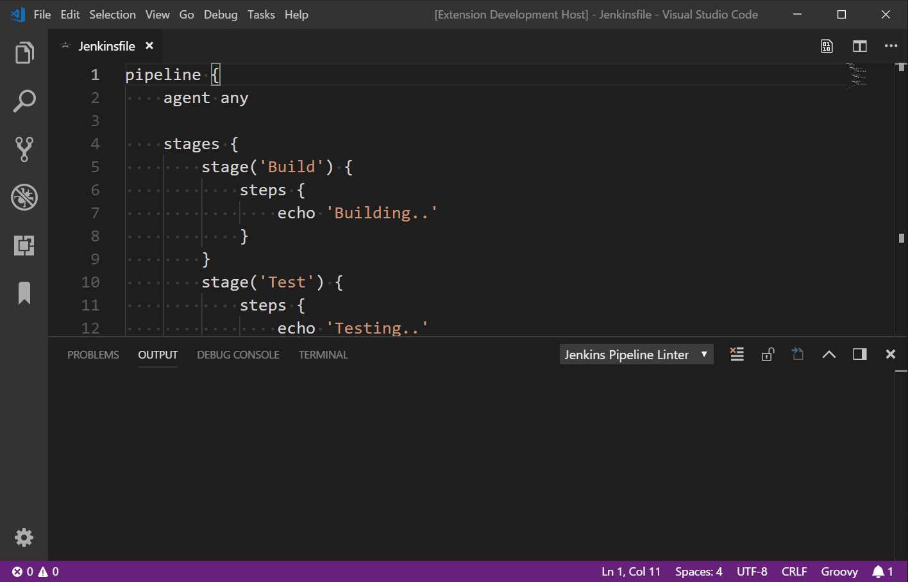

# jenkins-pipeline-linter-connector README

This extension validates Jenkinsfiles by sending them to the Pipeline Linter of a Jenkins server.

## Features

- Validate Jenkinsfiles from wihin vscode.
- Supports declarative pipeline only.

## Examples

## Extension Settings

This extension contributes the following settings:

* `jenkins.pipeline.linter.connector.url`: Url of the Jenkins Pipeline Linter.
* `jenkins.pipeline.linter.connector.crumbUrl`: Url of the Jenkins Crumb Issuer.
* `jenkins.pipeline.linter.connector.pass`: Jenkins password (can be left blank if you don't want to put your password in your settings).
* `jenkins.pipeline.linter.connector.user`: Jenkins username.
* `jenkins.pipeline.linter.connector.strictssl`: Set to false to allow invalid ssl connections.

## Contributors

* [Asif Kamran Malick](https://github.com/akmalick)
* [backbasejeff](https://github.com/backbasejeff)
* [Blake Easley](https://github.com/Jimmyscene)
* [Tomáš Hartmann](https://github.com/cvakiitho)

## Release Notes

### 1.1.7
Fixed error in readme.

### 1.1.6

Clear output before run.

### 1.1.5

Mask manual password input.

### 1.1.4

Added possibility to leave password option blank, when setting user name.

### 1.1.3

Added option to disable strict ssl validation.

### 1.1.2

Changed readme.

### 1.1.1

Changed dependency of url-parse for potential security problem.

### 1.1.0

Added the possibility to add the crumbUrl for Jenkins installations with active CRSF protection.

### 1.0.4

Changed output channel.

### 1.0.3

Bugfixes.

### 1.0.2

Bugfixes.

### 1.0.1

Bugfixes.

### 1.0.0

Initial release of jenkins-pipeline-linter-connector.
